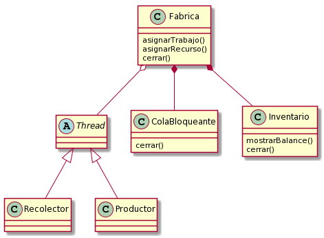
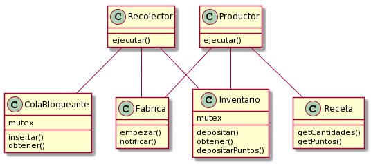

# Informe Trabajo Práctico 2

Nombre: Lautaro Gastón Fritz

Padrón: 102320

Enlace al repositorio de GitHub: https://github.com/lautarofritz/tp2

## Introducción

En el presente informe se detalla la resolución del Trabajo Práctico 2, el cual consistía en simular el comportamiento de un poblado/fábrica utilizando threads.

A continuación se detallan cuestiones tales como el diseño del programa y las decisiones detrás de él, y algunos de los problemas encontrados a lo largo del desarrollo.

## Diseño

A continuación se muestran dos diagramas con las clases que componen el modelo: uno centrado en la clase Fábrica y su relación con los contenedores y trabajadores, y otro más bien enfocado en los trabajadores.

Se optó por tener una clase Fábrica que esté compuesta por los contenedores de recursos (las distintas colas bloqueantes y el inventario), que tenga la responsabilidad de spawnear al resto de los hilos (los trabajadores), además de coordinar el cierre de los contenedores para la salida del programa.

Los trabajadores (tanto Recolectores como Productores) heredan de la clase Thread y encapsulan el hilo dentro de ellos. Son, por lo tanto, objetos activos. De esta forma se simplifica ligeramente la iniciación de los mismos.

Ni los Recolectores ni los Productores actúan de forma diferente en base al recurso que necesiten, sino que todos los trabajadores de una misma categoría tienen un comportamiento similar: los Recolectores llevan materias primas de las colas al inventario, y los Productores transforman estos materiales en puntos de beneficio. Es por esto que no hay una clase por cada tipo de trabajador, sino que sólo se implementaron las dos diferencias básicas (entre Recolectores y Productores).

Hay una única clase ColaBloqueante, y las tres colas son instancias de esta. Se decidió esto ya que el comportamiento de las mismas no varía dependiendo del tipo de recurso que contengan, sino que es el mismo para todas.

Por las cuestiones anteriormente mencionadas (que ni los trabajadores ni las colas actúan diferente en base al tipo de recurso que contengan/usen), sumado a que los recursos en si no tienen comportamiento propio, se decidió no modelarlos como una clase.

El Inventario tiene una lógica similar a la de las colas (en el sentido que permite depositar y extraer recursos de él), pero con el agregado de que debe comprobar si se poseen los recursos necesarios para generar los puntos de beneficio. Por esta razón se creó una clase aparte de la de las colas.

Para no crear clases de más, y dado que el Inventario contiene información que luego será mostrada por pantalla (la cantidad de recursos que quedaron en él sin poder ser convertidos a puntos de beneficio), se optó que sea él también el encargado de acumular los puntos de beneficio.

Finalmente, la clase Receta posee los recursos necesarios y la cantidad de los mismos que necesita un Productor para generar puntos de beneficio, así como el número de puntos que se generarían en caso que el Inventario los posea. Esta información también se le podría haber pasado a los Productores directamente, pero de esta forma, quizás, disminuye un poco la responsabilidad de estos.

## Detalles de implementación y problemas encontrados

A continuación se expone una vista más profunda de las distintas etapas de ejecución del programa, junto con algunos inconvenientes hallados durante el desarrollo.

### Creación e inicialización de los trabajadores

Lo primero que se hace es leer del archivo de trabajadores tanto el tipo como la cantidad, y esto es pasado a la Fábrica para que vaya rellenando un arreglo de seis posiciones (una por cada tipo de trabajador) de vectores con los trabajadores indicados. Luego, una vez que se termino de leer el archivo y el arreglo está lleno, se procede a inicializar ("mandar a trabajar") a cada trabajador.

Como se vio anteriormente, ambas clases de trabajadores heredan de la clase Thread, lo que permite tener un único vector de trabajadores en vez de dos separados, lo que facilita la inicialización levemente.

También se mencionó antes que no se hizo una clase para cada tipo de trabajador, sino que sólo están diferenciados los Recolectores de los Productores. Lo que diferencia a los distintos tipos de Recolectores es la cola de la que extraen recursos: un Agricultor los sacará de la cola de trigo, mientras que un Leñador hará lo propio en la cola de madera. De esta forma, un Agricultor es simplemente una instancia de la clase Recolector que posee una referencia a la cola de trigo, y los demás casos son análogos.

Por su parte, cada tipo de Productor necesita diferentes tipos de materiales y en diferentes cantidades, pero más allá de esto no hay diferencias entre cada uno de ellos: todos extraen los materiales del mismo inventario compartido y depositan los puntos en el mismo lugar. Por esto mismo, en la implementación lo único que diferencia a los distintos tipos de Productores es la Receta con la que son inicializados. Así, por ejemplo, un Armero es una instancia de la clase Productor inicializada con una Receta que indica que para producir tres puntos de beneficio necesita dos carbones y dos hierros.

Además, ambas clases de trabajadores reciben una referencia al Inventario (ya que unos depositan los recursos allí y otros los extraen de ahí para los puntos) y una a la Fábrica (para poder notificarle del fin de su ciclo de trabajo).

### Llenado de las colas de recursos

Una vez terminado el paso anterior, se procede a leer el archivo con los recursos caracter por caracter, para enviarlos a la Fábrica y que esta los asigne a la cola adecuada dependiendo de su tipo. Los recursos no están modelados como una clase, sino que son simplemente un valor de tipo caracter.

Los materiales son recursos compartidos, y por lo tanto, deben ser protegidos ante una posible _race condition_. Por este motivo, las colas están implementadas como monitores, y tanto el ingreso como la extracción de recursos están protegidos por un mutex.

### Cierre de la Fábrica (parte 1)

Cuando se termina de parsear el mapa y todos los recursos fueron asignados a su respectiva cola, se procede a cerrar la Fábrica. Este cierre se produce en partes, siendo la primera el cierre de las colas bloqueantes. Esto marca que la cola no recibirá más recursos. Cada cola, al cerrarse, notifica a los Recolectores que estén esperando el ingreso de recursos.

Una vez hecho esto, la Fábrica debe aguardar a que no haya Recolectores activos para poder pasar a la siguiente fase. Esto se logra mediante una _condition variable_: cada vez que un Recolector termina su trabajo, notifica a la Fábrica, quien se despierta y se fija si la cantidad de Recolectores activos es 0 (lo que en realidad hace es chequear si la cantidad de trabajadores activos es mayor a la cantidad de Productores. Naturalmente, si estos valores son iguales, significa que no hay Recolectores activos).

### Recolección e inserción en el Inventario

Los Recolectores, por su parte, ya habían sido mandados a trabajar, pero como las colas estaban vacías, quedaron esperando el ingreso de recursos. Al ingresar uno, los Recolectores son notificados, se despiertan, y toman el recurso, para luego dormir por 50 ms y luego llevarlo al Inventario. Una vez hecho esto, vuelven a la cola para extraer recursos nuevamente.

El Inventario está implementado como un map, siendo las claves los caracteres que identifican a los recursos y los valores las cantidades de cada uno, inicialmente 0. Cuando un Recolector inserta un recurso en el Inventario, lo que se hace es simplemente aumentar en uno el valor de la entrada correspondiente a ese recurso.

Como se mencionó previamente, al cerrarse la cola, los trabajadores que estén esperando serán notificados y se despertarán. Si además la cola está vacía, se retorna un recurso especial (el caracter '\0'). Al recibir ese recurso, los Recolectores saben que su trabajo está terminado, por lo que vuelven y notifican a la Fábrica.

### Producción de puntos de beneficio

Al igual que los Recolectores, los Productores también habían sido mandados a trabajar, y también quedan esperando inicialmente la llegada de recursos al Inventario. A diferencia de los Recolectores, para poder salir del Inventario los Productores deben poder completar su Receta.

Cuando se inserta un recurso, todos los Productores que están esperando son notificados, sin importar si logran completar la Receta o no. En este momento, se verifica si se dispone de los recursos necesarios. De ser así, se restan del Inventario las cantidades solicitadas y se obtienen los puntos de beneficio dictados por la Receta. En caso contrario, los Productores quedarán esperando nuevamente. Cuando un Productor obtiene los puntos de beneficio, duerme durante 60 ms para luego depositarlos en el acumulador. Finalmente vuelve al Inventario para tratar de producir más puntos.

Es importante mencionar que el Inventario, al igual que las colas, debe restringir el acceso a los materiales, ya que son recursos compartidos. Así, las operaciones de inserción de recursos y obtención y depósito de puntos están protegidas con un mutex.

### Cierre de la Fábrica (parte 2)

A todo esto, una vez que se fueron todos los Recolectores, la Fábrica procede a cerrar el Inventario. El razonamiento detrás de esto es el siguiente: si no quedan Recolectores activos, no habrá más recursos ingresados en el Inventario. Por lo tanto, cualquier Productor que no haya podido completar su Receta deberá irse, ya que no podrá completarla nunca.

Al cerrarse el Inventario, son notificados todos los Productores que estén esperando, y se devuelve una cantidad especial de puntos de beneficio (0). Al recibir este valor, los Productores vuelven y notifican a la Fábrica.

El siguiente paso es salir y mostrar el total de puntos acumulados y los recursos sobrantes en el Inventario, pero para eso se debe esperar a que vuelvan todos los Productores. Nuevamente, esto se logra a través de una _condition variable_. La Fábrica espera a que vuelva un Productor y le notifique, en cuyo caso la Fábrica se despierta y chequea si la cantidad de Productores activos (y por lo tanto, la cantidad de trabajadores activos en total, ya que no hay Recolectores activos en este instante) es 0.

### Muestra por pantalla

El siguiente paso después del cierre total de la Fábrica es la muestra por pantalla de los puntos acumulados y de los recursos sobrantes en el Inventario. El Inventario es quien se encarga de esto, ya que es él quien posee todos estos valores.

### Problemas particulares

La parte del trabajo práctico que más costó (tanto por la lógica que implica como por la implementación) fue el cierre de la Fábrica. El hecho de tener que pensar cual es la condición de salida para cada tipo de trabajador (que es diferente en ambos casos), sumado a que estas salidas deben estar coordinadas trajo cierta complejidad. 

Se había pensado en hacerlo de otra forma, pasándole a cada trabajador una referencia a su respectiva _condition variable_ y también una referencia al contador de trabajadores activos correspondiente a su clase, pero esto rompe de cierta forma el encapsulamiento de la Fábrica, al permitirle a los trabajadores modificar un atributo de la misma. 